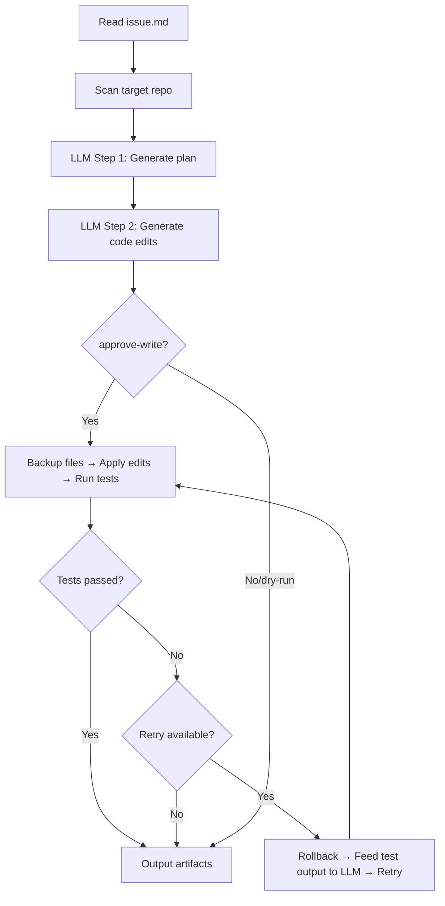

# RepoOps — Agentic Code Editing Pipeline

RepoOps is an agent workflow that turns **GitHub Issue descriptions into validated code edits**, end-to-end. It reads an issue, scans the target repository, generates a structured plan via LLM, produces code edits, applies them, runs tests, and automatically retries on failure — all without human intervention.

```
issue.md → repo scan → LLM plan → LLM edit → apply → test → [retry if failed] → artifacts
```

## Key Features

- **Two-step LLM chain** — Plan generation + code edit generation, powered by LangChain + Pydantic structured output
- **Exact string matching for edits** — Language-agnostic: LLM returns `original_snippet` / `proposed_snippet` pairs, applied via `str.replace`. Prompt engineering ensures verbatim copying
- **Closed-loop retry** — If tests fail, automatically rolls back files, feeds test output to LLM, and re-generates corrected edits (up to 2 retries)
- **Multi-provider support** — Pluggable LLM backends via provider registry: Gemini CLI, Claude Code CLI, Codex CLI, or deterministic mode for testing
- **Dynamic repo scanning** — Auto-detects project files (Makefile, pyproject.toml, package.json, Cargo.toml, go.mod) and extracts search keywords from issue text
- **Auto-detect validation command** — Picks the right test runner based on the target repo's build system
- **Edit failure diagnostics** — When snippet matching fails, reports the root cause (indentation mismatch, non-contiguous lines, missing code)

## Pipeline



Output artifacts: `plan.json`, `patch.diff`, `pr_draft.md`, `test_report.json`

## Project Structure

```
.
├── projects/
│   ├── repoops/                  # Core pipeline
│   │   ├── src/repoops/
│   │   │   ├── langchain_demo.py     # Two-step LLM chain + retry loop
│   │   │   ├── provider_registry.py  # Pluggable LLM provider factory
│   │   │   ├── read_only_tools.py    # Repo scanning (file listing, search, key file detection)
│   │   │   ├── write_actions.py      # Edit application, backup/rollback, diagnostics
│   │   │   ├── cli.py               # CLI entry point, validation, artifact persistence
│   │   │   ├── base_cli_provider.py  # Abstract base for CLI-based LLM providers
│   │   │   ├── gemini_cli_provider.py
│   │   │   ├── claude_code_cli_provider.py
│   │   │   └── codex_cli_provider.py
│   │   └── tests/                # 63 unit tests
│   └── shared/                   # Shared contracts (issue parsing, payload builder)
├── examples/
│   ├── demo-repo/                # Target repo for e2e testing (intentional bug)
│   └── issues/                   # Sample issue descriptions
├── docs/
│   ├── pipeline.mmd              # Mermaid flowchart source
│   └── interview/                # Interview prep notes
├── scripts/                      # Environment setup helpers
├── Makefile
└── environment.yml
```

## Quickstart

```bash
# Set up micromamba environment + install local packages
make setup-env

# Run checks and tests (63 tests)
make check
make test

# Run pipeline in dry-run mode (deterministic, no LLM)
make demo-repoops-langchain

# Run with real LLM providers
make demo-repoops-langchain-gemini
make demo-repoops-langchain-claude

# Run against the demo-repo with live edits
./scripts/run_in_mamba.sh python -m repoops.langchain_demo \
    --repo examples/demo-repo \
    --issue examples/demo-repo/issue.md \
    --provider gemini-cli \
    --approve-write
```

## How It Works

### 1. Repo Scan (`read_only_tools.py`)

Scans the target repository to build context for the LLM:
- **Auto-detects key files** by checking for well-known project files (README, Makefile, pyproject.toml, etc.)
- **Extracts search keywords** from the issue text (frequency-ranked, stop-word filtered)
- **Code search** finds relevant files matching those keywords

### 2. Plan Generation (`langchain_demo.py`)

LangChain `PromptTemplate → LLM → PydanticOutputParser` chain produces a `PlanDraftModel` with structured steps and acceptance criteria.

### 3. Edit Generation

A second chain produces `EditPlanModel` — a list of `{path, original_snippet, proposed_snippet}` pairs. The prompt includes **CRITICAL RULES** enforcing verbatim snippet copying to ensure exact string matching works.

### 4. Apply + Validate + Retry

```
for attempt in range(1 + MAX_RETRIES):
    backup files → apply edits (str.replace) → run tests
    if passed: break
    rollback files → feed test output to LLM → get new edits
```

### 5. Artifacts

Each run produces: `plan.json` (full payload), `patch.diff`, `pr_draft.md`, and `test_report.json`.

## Design Decisions

| Decision | Why |
|----------|-----|
| Exact string match over AST/diff | Language-agnostic, simple, and surprisingly reliable with good prompts |
| Prompt engineering over fuzzy matching | Constraining LLM behavior at the source is simpler than compensating downstream |
| Provider registry pattern | Adding a new LLM backend = one line of registration, not copy-pasting if/elif chains |
| Dynamic repo scan | RepoOps should work on any target repo, not just itself |
| Closed-loop retry with rollback | LLMs can self-correct when given concrete test failure output |

## Configuration

- `environment.yml` — micromamba environment spec
- `Makefile` — standard targets
- `AGENTS.md` — agent behavior rules
